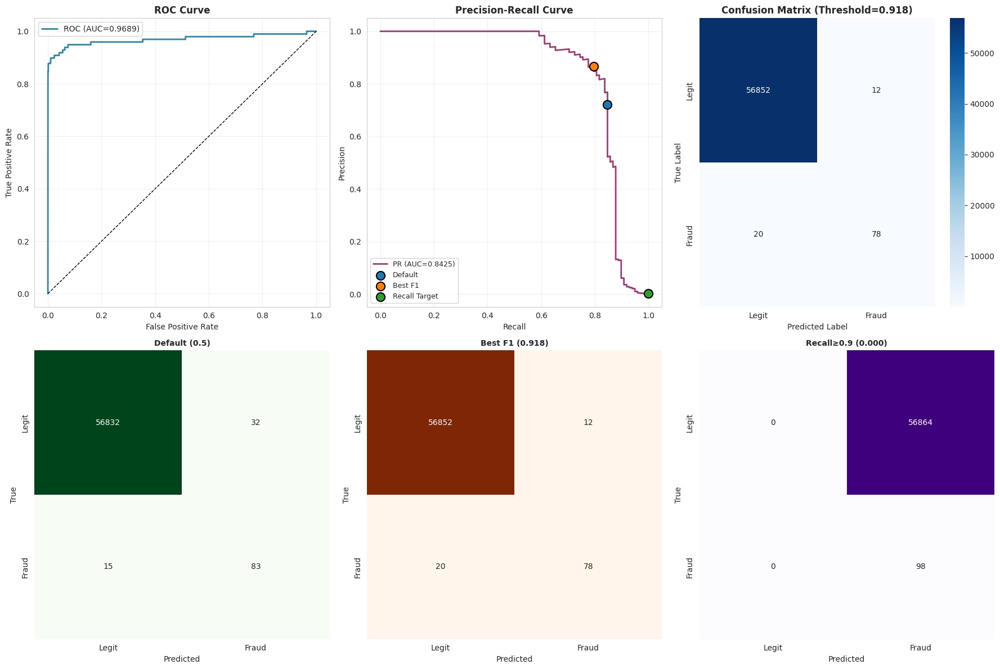
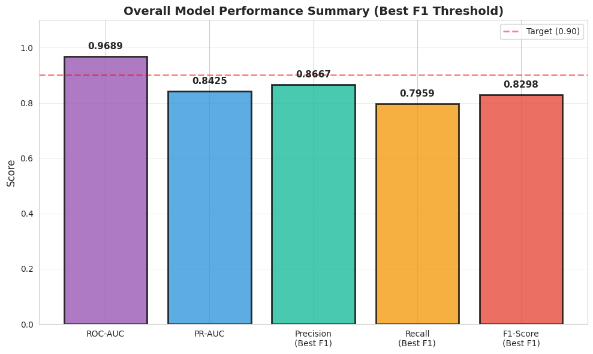
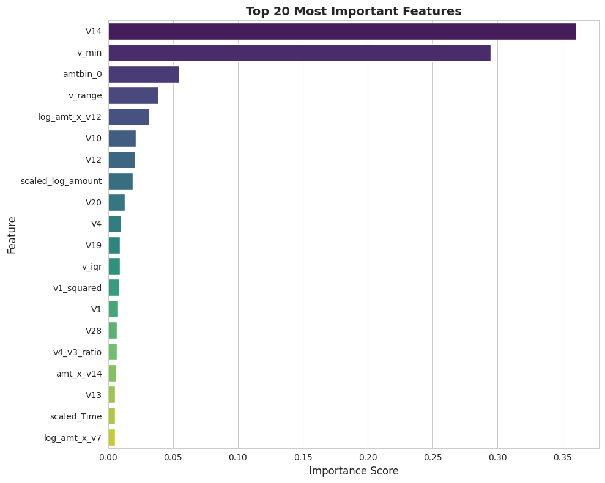
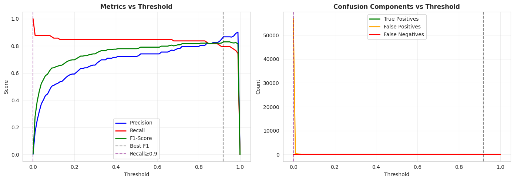

# Credit Card Fraud Detection System

This project is an end-to-end machine learning system for detecting fraudulent credit card transactions.  
I built this project to understand how real-world fraud detection systems work, especially with highly imbalanced data.

It covers the complete pipeline from data preprocessing to model training, evaluation, and threshold optimization.

---

## Project Motivation

Credit card fraud causes huge financial losses every year.  
The main challenge in fraud detection is that fraudulent transactions are very rare compared to normal ones.

Through this project, I wanted to learn:
- How to handle imbalanced datasets
- How to improve model performance using feature engineering
- How to tune thresholds based on business needs
- How to evaluate models beyond just accuracy

---

## Dataset

- Source: Kaggle Credit Card Fraud Dataset
- Total Transactions: 284,807
- Fraud Cases: 492
- Features: PCA-transformed + Amount + Time

Note: The dataset is not included in this repository due to size and licensing.

---

## Technologies Used

- Python
- Pandas, NumPy
- Scikit-learn
- XGBoost
- Imbalanced-learn (SMOTE)
- Matplotlib, Seaborn

---

## Approach

The complete workflow of this project:

1. Data Cleaning and Preprocessing  
2. Feature Engineering  
   - Amount transformations  
   - Time-based features  
   - Aggregated V-features  
   - Interaction features  
3. Feature Scaling using RobustScaler  
4. Feature Selection using XGBoost  
5. Handling Imbalanced Data using SMOTE  
6. Model Training using XGBoost  
7. Threshold Optimization  
8. Performance Evaluation and Visualization  
9. Live Prediction Demonstration  

---

## Model Details

- Algorithm: XGBoost Classifier
- Feature Selection: SelectFromModel
- Oversampling: SMOTE
- Threshold Tuning: Based on F1-score and Recall

---

## Results

| Metric | Value |
|--------|--------|
| ROC-AUC | 0.97 |
| PR-AUC | 0.84 |
| Precision | 86% |
| Recall | 79% |
| F1-Score | 82% |

These results show that the model performs well even with highly imbalanced data.

---

## Visualizations

### ROC and Precision-Recall Curve and Confusion Matrix

### Model Performance

### Feature Importance

### Threshold Analysis

---
